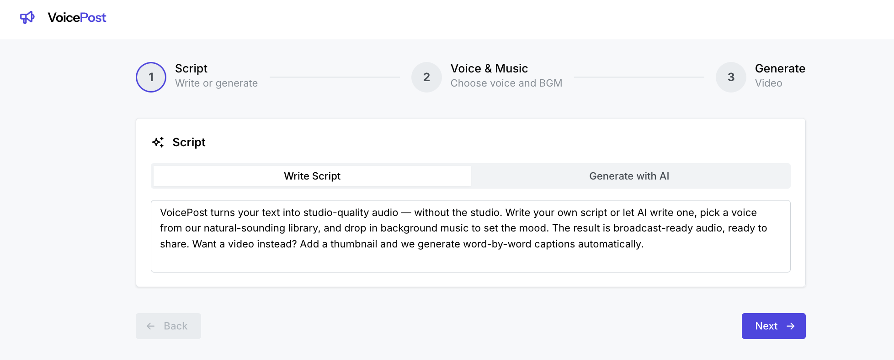
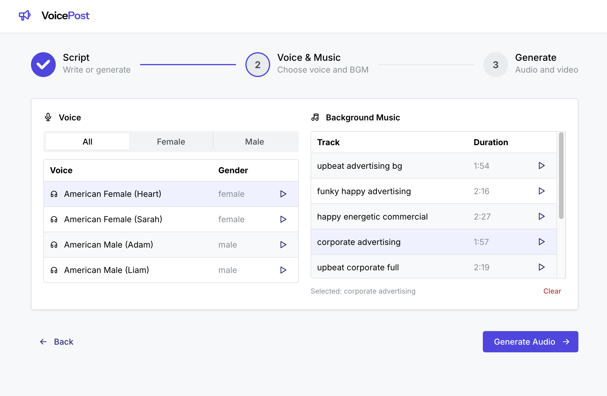
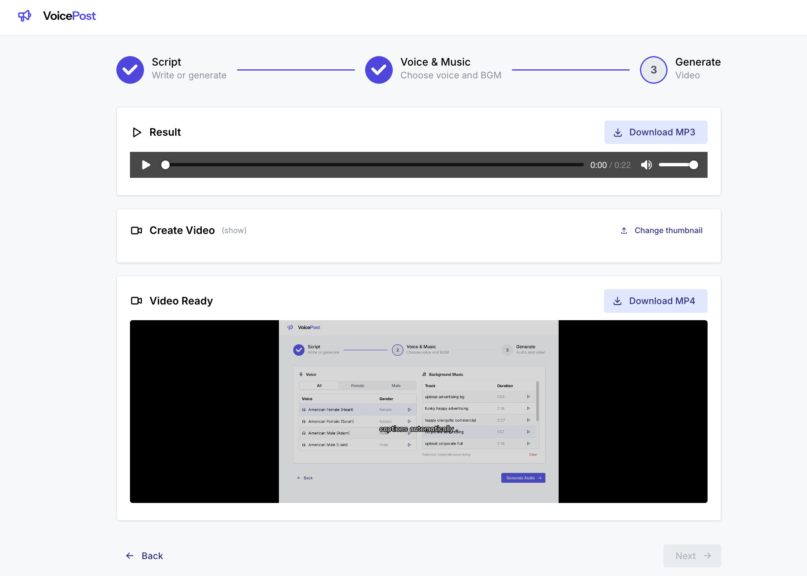

# VoicePost

VoicePost turns your text into studio-quality audio — without the studio. Write your own script or let AI write one, pick a voice from our natural-sounding library, and drop in background music to set the mood. The result is broadcast-ready audio, ready to share. Want a video instead? Add a thumbnail and we generate word-by-word captions automatically.

## Features

- 🤖 **AI script generation** — write your own copy or let Qwen 3 1.7B draft it for you
- 🎙️ **Natural-sounding voices** — pick from a library of Kokoro TTS voices
- 🎶 **Background music** — drop in curated BGM tracks to set the mood
- 🎚️ **Studio-quality mastering** — high-pass, EQ, loudness normalization, and limiting
- 🎬 **Captioned video** — word-by-word captions timed precisely to the audio
- 📍 **Drag-to-position** — move the caption and waveform to the perfect spot
- 🏠 **Runs locally** — Kokoro + Ollama + ffmpeg, all on your machine
- 📥 **Export ready** — download as MP3 audio or MP4 video

## How it works

---

**Step 1 — Write or generate your script**

Compose your own ad copy or let AI draft one for you.

<br>

<p align="center">
  
</p>

---

**Step 2 — Pick a voice and background music**

Choose from a library of natural-sounding voices and curated BGM tracks, then generate the audio.

<br>

<p align="center">
  
</p>

---

**Step 3 — Generate the video**

Add a thumbnail, and VoicePost produces a captioned MP4 with word-by-word captions timed to the audio.

<br>

<p align="center">
  
</p>

## Demo

Here is a generated video.

<p align="center">
  <a href="https://youtu.be/aPalRWJQ-00"></a>
</p>

## Tech stack

| Layer | Tech |
|---|---|
| **Speech synthesis** | [Kokoro TTS](https://github.com/hexgrad/kokoro) (KPipeline) — natural on-device TTS |
| **Script generation** | [Qwen 3 1.7B](https://ollama.com/library/qwen3) via [Ollama](https://ollama.com/) — local LLM |
| **Audio mastering** | ffmpeg — high-pass, EQ, loudness normalization, limiter + BGM mixing |
| **Video & captions** | ffmpeg + custom caption engine — word-level timing from Kokoro token timestamps |
| **Backend API** | Hono (TypeScript) |
| **Frontend** | React 19 + Mantine 9 + Vite |
| **Validation** | ArkType (shared between backend and frontend) |

## Prerequisites

| Tool | Version | Purpose |
|---|---|---|
| [Node.js](https://nodejs.org/) | >= 20 | Backend + frontend |
| [pnpm](https://pnpm.io/) | >= 10 | Workspace package manager |
| [Python](https://www.python.org/) | 3.12 | Kokoro TTS service |
| [uv](https://docs.astral.sh/uv/) | >= 0.5 | Python venv + dependency management |
| [ffmpeg](https://ffmpeg.org/) | >= 7 | Audio/video processing |
| [Ollama](https://ollama.com/) | >= 0.31 | Local LLM for script generation |

## Quick start

```bash
# 1. Clone and install
git clone <repo-url> VoicePost && cd VoicePost
pnpm install

# 2. Set up the Kokoro TTS venv
cd kokoro-service
uv venv --python 3.12
uv pip install -r requirements.txt
cd ..

# 3. Pull the Ollama model
ollama pull qwen3:1.7b

# 4. Start everything
./run.sh
```
